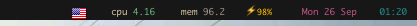
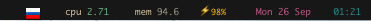

Ubersicht Current Keymap widget
===============================

Screenshots
-----------
US keymap:

RU keymap:

Installation
------------

* Download the repo
* Unzip (if needed)
* Select 'Open Widgets Folder' from the Übersicht menu in the top menu bar
* Drag the `showInputSource.widget` to the widgets folder you opened in step before

TODO
----

Currently only two languages are supported:

* English (US)
* Russia (RU)

So only these flags are showing. 

Contribution & Feature requests
-------------------------------
Contributors are highly welcome. Just send a pull requests. 

If you wish to add new languages please create an issue here 
or contact me.

*<3*
